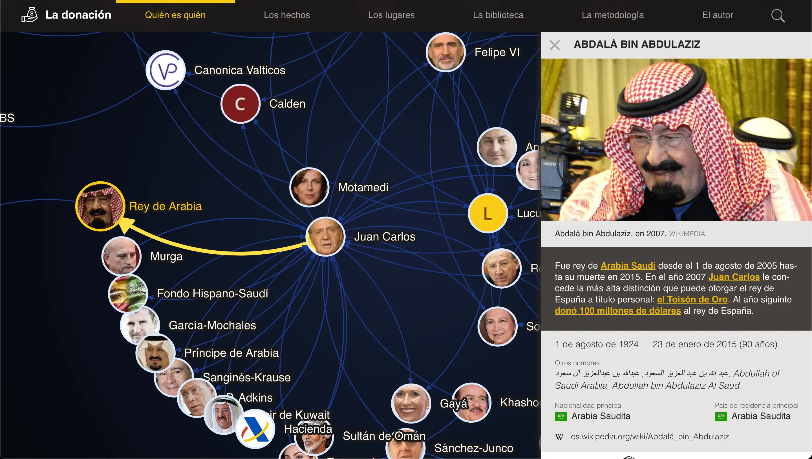
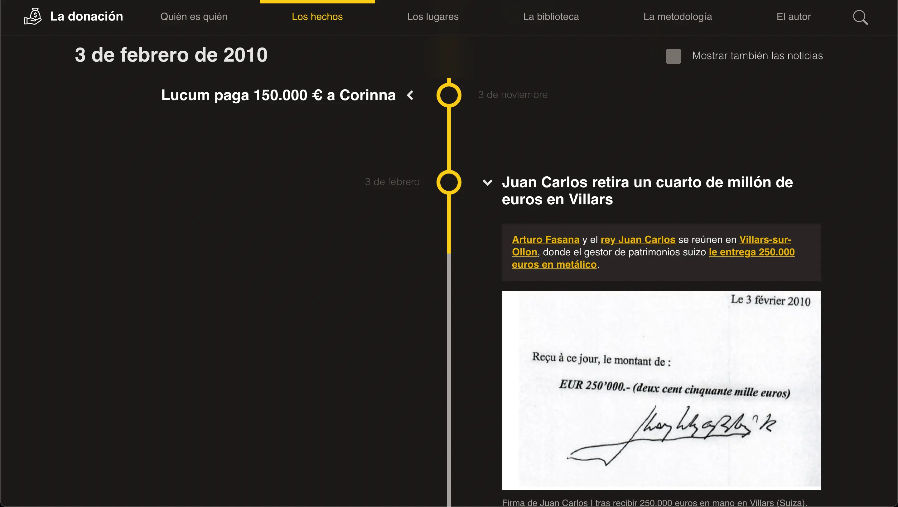
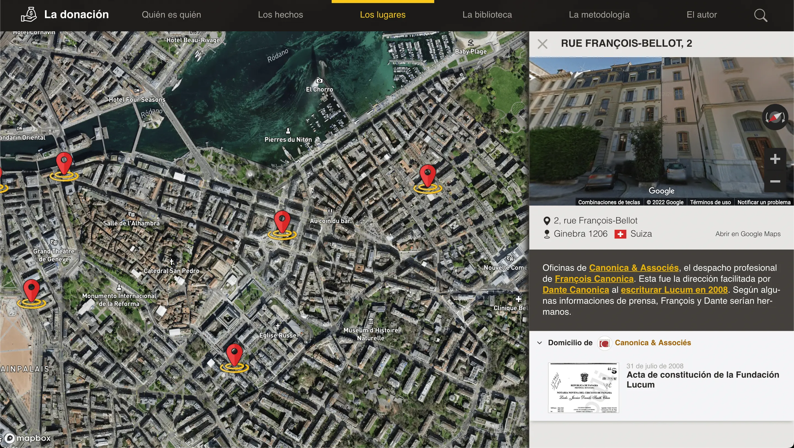
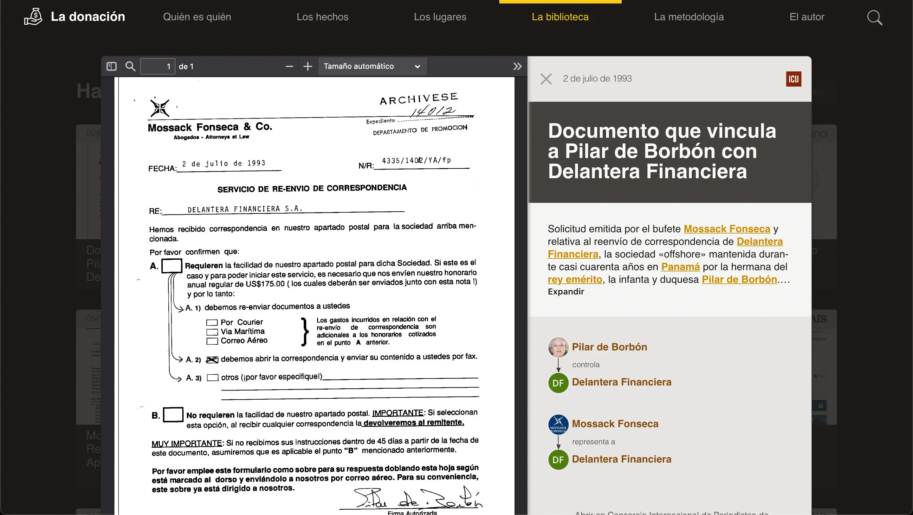

# _La Donación_ source code and documentation

[](http://www.gnu.org/licenses/agpl-3.0)
<span class="badge-patreon"><a href="https://patreon.com/jaime_gomez_obregon" title="Apoya este proyecto en Patreon"></a></span>

[La donación](https://ladonacion.es) (Spanish for "the donation") is a
data-driven set of rich interactive visualizations exposing all the known
details about the donation in 2012 of 65 million euros from the then King of
Spain, Juan Carlos I, to Dutch-German businesswoman and socialite Corinna zu
Sayn-Wittgenstein.

|                       |                             |                          |
| --------------------- | --------------------------- | ------------------------ |
|  |        |    |
|   |  |  |

This repository contains the complete source code of the website at
`ladonacion.es` and the documentation needed to help understand its internals.

The software powering the visualizations and the database holding de details of
the particular story about the Spanish Royal Household are kept apart, menaning
the code and the data are completely separated and decoupled. This means **the
software can be easily reused to convey the story of your choice**.

By open sourcing it I aim to:

- Pave the road for other investigative journalists to share their own
  investigations of public interest. Specially when it comes to exposing fraud
  and corruption.

- Encourage others to build upon my work, by reusing and adapting it as a
  boilerplate for their own stories.

- Give back to the community, from which I have received vast amounts of insight
  and inspiration.

---

⭐ **Like it? Then star it now on GitHub**.\
It only costs you a click and it greatly helps others discover it. ❤️

---

# Background

What can we citizens do against the endemic problem of corruption in politics
and institutions? We all see how technology is transforming the world, and my
hypothesis is that technology can also transform the way fraud and corruption is
exposed and combated.

Massive data leaks, such as the
[Lagarde and Falciani lists](https://en.wikipedia.org/wiki/Lagarde_list) or the
[Panama Papers](https://en.wikipedia.org/wiki/Panama_Papers), have for the first
time exposed the vulnerability of the global money laundering, tax evasion and
organized crime machinery. And data science unearths tangible evidence from a
vast ocean of information that is otherwise impenetrable to human endeavor.

Interested in this intellectual challenge, I, a software engineer specialized in
data, have applied a methodology to the exploration of the recent scandals
surrounding the Spanish Royal House.

I have gathered a corpus of documentation about the alleged corruption in the
Spanish Royal House from an extensive set of national and foreign public
sources. Most of it comes from the legal proceedings, mainly in Geneve,
Switzerland, leaked to and published by the European press. Other sources
featured in the application's
[extensive library](https://ladonacion.es/biblioteca) include:

- The Panama and Paradise papers and the Bahamas Leaks, all three published by
  the International Consortium of Investigative Journalists (ICIJ)
- The United Kingdom Companies House
- The Spanish Official Gazette ("Boletín Oficial del Estado")
- The Spanish Royal Household itself
- Other public records

The broad transversality of the sources ensures a multilateral approach to the
matter.

To strip the information of the interpretive bias of the media, I have
prioritized the documents of the judicial investigation: company deeds, bank
statements, official models, correspondence between the actors…

From this documentary corpus I have designed
[an ontology](<https://en.wikipedia.org/wiki/Ontology_(information_science)>)
with classes, objects, attributes, rules and a vocabulary of relationships. I
have modeled each document on this abstract framework, thus obtaining a
structured representation of the entire plot that I have then addressed using
software that I have developed for this purpose.

Finally, I have built the interactive visualizations that make this data model
visually explorable, so that any user can navigate through each element of the
plot without sacrificing detail.

## A document-driven tool for exploration

This of the Royal Household is a highly relevant and polarizing story in Spain
and it has been one of my goals from the very beginning to approach it from a
document-driven and opinionless framework.

Thus, the information architecture behind the application is laid out in such a
fashion which makes it impossible to assert a fact if there is not at least one
document in the library providing evidence. So by design no claim is made and no
position is taken from me as a storyteller.

# Application overview

While the web application is intended for a Spanish audience and the user
interface is presented in Spanish, both the source code and this documentation
are written in English.

As with most web applications, you can think about this one as two independent
layers. One contains the logic needed to build and display the user interface
and the interactive visualizations. The other holds the data fueling it.

You surely want to keep the application logic, adapt it's text strings and
design aesthetics, and ditch the topmost layer to replace it with your own
datasource.

<p align="center" style="margin: 1em;">
  
</p>

# Starting up

Here it is assume you already have `git` and `npm` installed on your local
machine.

1. Clone the repo:

   ```console
   $ git clone https://github.com/JaimeObregon/ladonacion.git
   ```

1. Install the project's dependencies:

   ```console
   $ cd ladonacion
   $ npm install
   ```

1. Fire up the development web server:

   ```console
   $ npm run dev
   ```

A new tab should pop up in your browser, serving the app from your local
[`httpdocs`](/httpdocs) directory.

## Building the data model

I haver collected, analyzed and connected these documents with the help of a
custom methodology and tooling available under [`/data`](/data) and
[`/bin`](/bin). These two are not deployed, but used to validate and compile the
final data structure consumed by the web application.

# Reuse and adapt it to convey your story!

This GitHub repository contains both the web application powering the
interactive visualizations and the details around this particular story. Both
—code and data— are separated and decoupled.

This means **the application can be easily reused and adapted to power other
investigations**. It best fits one which has can be clearly expressed in the
following four planes:

|                                                     |                                                                                                                           |
| --------------------------------------------------- | ------------------------------------------------------------------------------------------------------------------------- |
|     | 1. **A network of relations between persons or business entities**. (The [who is who](https://ladonacion.es/entramado))   |
|  | 2. **A sequential set of events**. ([The facts](https://ladonacion.es/cronologia))                                        |
|     | 3. **A geographical dimension**. ([The places](https://ladonacion.es/mapa))                                               |
|      | 4. **A repository of documents** from which the whole story is derived. ([The library](https://ladonacion.es/biblioteca)) |

# Technical overview

The technological stack comprises only web standards. The application is fully
static and writen in modern JavaScript (ECMAScript 6), web components, ES
modules, shadow DOM, HTML5, CSS3. Therefore there are no other user requisites
than a modern web browser.

The user interface is fully componentized. Other of my goals with this project
has been to demonstrate that it is possible to build a reasonably complex web
application [without frontend frameworks](https://www.frameworklessmovement.org)
such as React, Vue or Angular, and in the absence of transpilers such as Babel
and complex build processes.

The _Who is who_ dynamic graph is built upon Mike Bostock's excelent
[D3](https://d3js.org) charting library. The rest of the site if manually
crafted.

# Deployment

Deploy to production is done via `rsync` with every _push_ to the `master`
branch. See the provided GitHub action at
[`/.github/workflows/main.yml`](/.github/workflows/main.yml).

# How to contact, ask and contribute

Like in any open source software project, contributions to this repository are
very welcome. However, before submitting your contribution please note the
following:

- If you detect any issue in the software or have any questions, comments or
  requests, please
  **[open an issue](https://github.com/jaimeobregon/ladonacion.es/issues)** here
  on Github and I or the community will try to resolve it or respond to you.

- If your contribution or comment is about the plot of the story, please keep in
  mind that **I will only incorporate factual data that is supported by public
  sources or documents, ideally official sources and sufficiently established
  and recognized public media**. This is not a place for opinions,
  subjectivities or untested assumptions.

- Feel free to
  **[submit pull requests](https://github.com/jaimeobregon/ladonacion.es/pulls)**
  with your contributions, but before contributing, please open an issue first
  and share your plans. I have a very clear vision for this project and its
  goals, as well as high standards for merging contributions, so sharing your
  plans in an issue beforehand will maximize the chances of it being accepted.

- If you want to specifically address me as the original author of this project,
  you can **[reach me on Twitter](https://twitter.com/JaimeObregon)**.

# How to help

1. ⭐ **Star this project on GitHub**. It costs you only a click and it greatly
   helps its discoverabilty.

1. Contribute code or documentation.

1. [Support me on Patreon](https://www.patreon.com/jaime_gomez_obregon).

# About the author

The whole project, from the design of the data model to the coding itself, has
been done in 2021 by me, [Jaime Gómez-Obregón](https://jaime.gomezobregon.com).

# License

This project is released under the GNU Affero General Public License (see
[`/LICENSE`](/LICENSE)).

    La donación
    Copyright (C) 2021-2022 Jaime Gómez-Obregón

    This program is free software: you can redistribute it and/or modify
    it under the terms of the GNU Affero General Public License as published
    by the Free Software Foundation, either version 3 of the License, or
    (at your option) any later version.

    This program is distributed in the hope that it will be useful,
    but WITHOUT ANY WARRANTY; without even the implied warranty of
    MERCHANTABILITY or FITNESS FOR A PARTICULAR PURPOSE.  See the
    GNU Affero General Public License for more details.

    You should have received a copy of the GNU Affero General Public License
    along with this program. If not, see <https://www.gnu.org/licenses/>.
